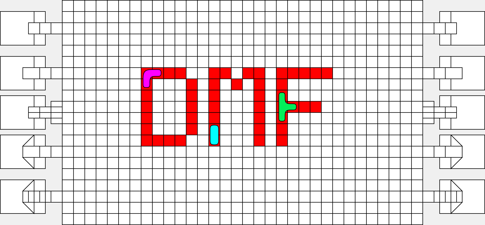

# A Logic-Based Physical Simulation Framework for Digital Microfluidic Biochips




# Overview
The simulation framework is a logic-based physical framework, and consists of the following core components:

- **Simulation Engine** the main driver, responsible for executing commands and controlling the simulation.

- **Graphical User Interface** displays the simulated board and information of the simualtion.

- **Simulation models** used to peform simulation specefic calculations.

- **BioVM** controls the datastream of commands sent to, and executed by the simulation engine.


# Running the simulation framework

## Production
The newest production build is hosted on a publically available [webpage](https://microfluidicsimulator.azurewebsites.net), and can be run by uploading a configuration and protocol. Example configurations and protocols can be found in the ``Assets/Sample Data`` folder.


## Local
To run the local version of the simulation framework, you first need to clone the source code from GitHub, using
```
git clone git@github.com:DracusC/Development-of-a-simulation-framework-for-digital-microfluidic-biochips.git
```
Once the solution is opened in Visual Studio,  you can run it using the UI or by hitting ```Ctrl + F5```.

# Testing and further development
If you intend to contribute to the project, either by fixing bugs or contributing new features, you need to fork the project using
```
git clone https://github.com/yourname/Development-of-a-simulation-framework-for-digital-microfluidic-biochips.git
```
Once you have a proposed update for the project, then open a pull request and supply a short description of the changes you have made.

```Further deveoplment has to be carried out on the forked project so that pull request can be made.```

The simulator allows for interchangeability to the 4 components mentioned in the [Overview](#Overview) section. To change behavior of the droplets in the Simulator, models can be changed, removed or added. A short guide on changing models can be found in the [Thesis](Assets/Documents/DMFb_SimulationFramework_Thesis.pdf), section 7.

# Documentation
A thesis decribing the development and features of the simulator can be found [here](Assets/Documents/DMFb_SimulationFramework_Thesis.pdf).

# License
The Simulation Framework is licensed under the MIT liscense, read more [here](LICENSE.md).
